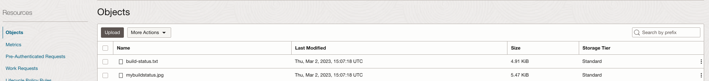

# oci-buildstatus-badges

It is a workaround to display the build status on to OCI Code repo readme.

### Logic in short

We will be using the `OCI Service connector hub` and `OCI Function` to fetch the status and update the content and an icon back to `OCI Object Storage`.


### OCI Identity setup

- Create OCI Dynamic groups with the below rules at a minimum.

```java
ALL {resource.type = 'devopsbuildpipeline', resource.compartment.id = 'OCID OF YOUR COMPARTMENT'}

ALL {resource.type = 'fnfunc', resource.compartment.id = 'OCID OF YOUR COMPARTMENT'}
```

- Create OCI Policies with the below statements

```java
Allow dynamic-group <NAME OF THE DG> to manage on-topics in compartment <NAME OF THE COMPARTMENT>
Allow dynamic-group <NAME OF THE DG> to manage object-family in compartment <NAME OF THE COMPARTMENT>
```

### OCI Object storage bucket

- Create an OCI Object storage bucket. - https://docs.oracle.com/en-us/iaas/Content/Object/Tasks/managingbuckets_topic-To_create_a_bucket.htm


- Upload all the files in the folder `status-icons` as objects.


### OCI Function setup

- Before setting this up ensure you have a valid `Oracle Virtual cloud network (VCN)` created and running.
- Create a function application -  https://docs.oracle.com/en-us/iaas/Content/Functions/Tasks/functionscreatingapps.htm#Creating_Applications


- Using `getting started` up to setup 7 and setup access to a container registry and function applications.

- Clone the content to a cloud shell or a workstation where `fn` cli is set up. Preferably use OCI Code editor(if it's via cloud shell) to update files and execute.

- Update file [func.yaml](func.yaml) with appropriate values.


- Update the default filenames/function name etc within func. yaml in case you have uploaded the files with different names to the object storage.

- Always ensure and confirm that the filenames (including the default one) are unique within the considered bucket to avoid an `override` concern.

- Deploy the function

```java
fn -v deploy --app <FUNCTION APP NAME>
```
- Validate the deployment and enable logs for the application via OCI Console.


### OCI DevOps setup.

- Create an OCI notification topic - https://docs.oracle.com/en-us/iaas/Content/Notification/Tasks/create-topic.htm

- Create an OCI DevOps project & Enable logs for the project.
- Create an OCI code repo.
- Upload the contents to the OCI Code repo.
- Within the build pipeline add a `Managed build stage use the code repo created and default build_spec.yaml for the stage.


a
### OCI Service connector hub setup.
- Create a service connector hub.
- Use `Logging` as the source and `Functions` as Target.


- With the source connection, select the compartment and the log group and log name created for the OCI DevOps project.


- Within the log filter task select property `data.buildPipelineId` `=` to the `OCID of the build pipeline created and property `data. message` `=` to `Completed Build stage`


- Within `Configure target` select the appropriate function application and function name.


- Accept the policy recommendation for the service connector hub.


### Validate the setup.

- Switch to build pipeline and do a manual run.


- Wait for its completion.

- It will take a while for the service connector hub to update the status. Use Function application `logs` and follow the execution. For any errors, the logs will help you do a debug.


- To fetch the URL for `status icon` and `status in details`, switch back to `OCI OBJECT Storage Bucket`
- Within the bucket, it should create two files, one image and one text file.



- The image object would provide a status icon of any of the below.


- The text file contains the details of the last execution (Be aware it includes different OCIDs or exported variable values etc)


- To expose these URLs to your code repo's README, create a `Pre Authenticated request` for the image and text file.

- Add the reference back to the code repo's readme and push it back and verify the details. The readme format is as follows

```java
[](URL TO THE TEXT FILE)
```


- So based on the build status the status and details will be updated.


### Tail end

- This is just a workaround.
- It is using a publicly routed URL to display the status and details.
- There are many ways the code can be updated to fetch the details out of build run output (json)


## Contributors

Author: Rahul M R.
Collaborators: NA
Last release: March 2023


